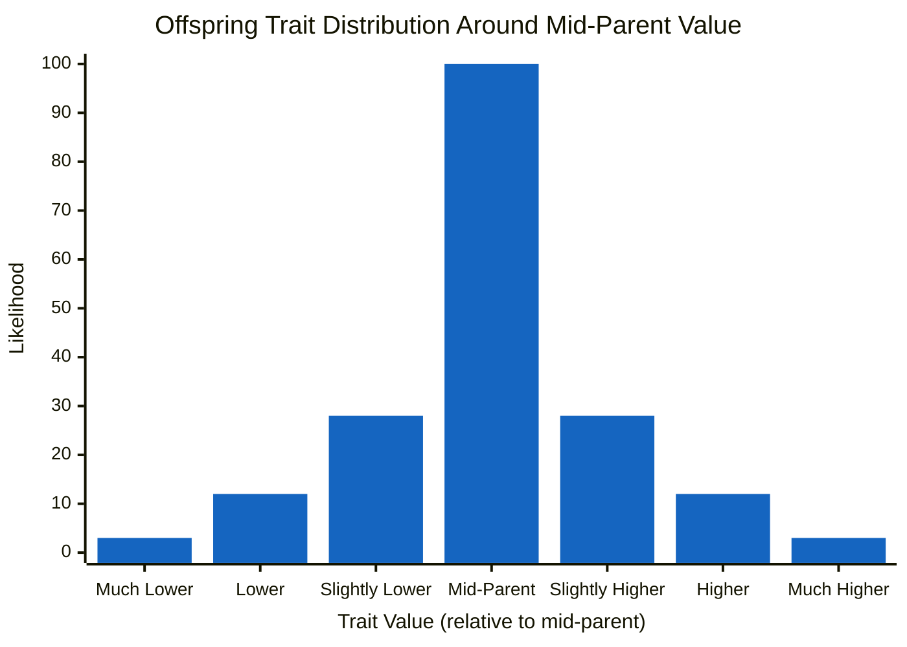
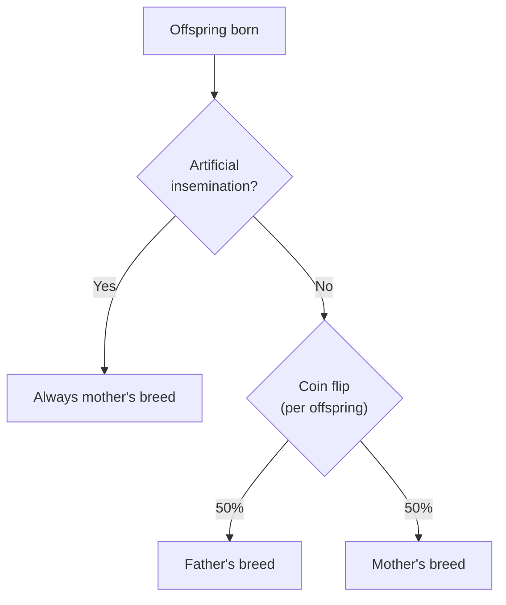
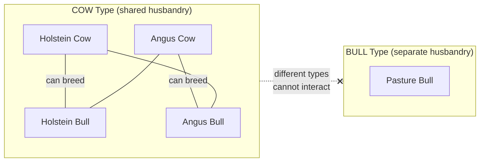

# Frequently Asked Questions

Common questions about Realistic Livestock RM, covering genetics, breeding, and mod scope.

> **Note:** This documentation was generated with AI assistance and may contain inaccuracies. If you spot an error, please [open an issue](https://github.com/rittermod/FS25_RealisticLivestockRM/issues).

---

## How can offspring have worse genetics than their parents?

**Short answer:** Breeding two high-genetics animals improves your odds of good offspring, but it doesn't guarantee every single one will match the parents. Some calves will be better, some will be worse - that's how real genetics works, and the mod simulates this.

### What changed from the original mod

Arrow-kb's original version used a simple model where offspring were randomly placed somewhere between the two parents' values. No variation beyond that range, no chance of outperforming the parents, and no regression. It was predictable but unrealistic.

The current version uses a more realistic genetic model: the offspring's trait value is based on the **average of both parents** plus some **random variation**. This means offspring can exceed both parents - or fall below both.

### Why it happens

Each parent carries a mix of "good" and "not so good" genes. A high-producing cow doesn't only carry great genes - she also carries some weaker ones that aren't visible in her own stats. When two parents each pass a random half of their genes to the calf, the calf might inherit an unlucky combination and end up worse than either parent.

### What the mod does

The mod calculates the average of both parents' trait values (the "mid-parent value"), then adds random variation using a bell curve. Most offspring land near that average, but some land higher and some lower - with roughly equal probability in both directions.

*Most offspring cluster around the mid-parent average. A few will be noticeably better or worse. Extreme outliers in either direction are rare but possible.*

### Regression to the mean

This is a well-known phenomenon in genetics called **regression to the mean**, first discovered by Francis Galton in the 1880s. He noticed that children of very tall parents were tall, but usually not quite as tall as their parents. The same goes the other way - children of short parents tend to be a bit taller than their parents.

In the mod, breeding two "Extremely High" productivity cows will produce calves that are above average - but many of them will be "Very High" rather than "Extremely High." The parents were statistical outliers, and their offspring tend to drift back towards the population average.

### Where you'll notice it first

Chickens cycle through generations much faster than other animals (2-month hatching vs 10-month cattle gestation), so genetic drift shows up in your chicken flock first. If you're seeing unexpected drops in egg production across generations, this is likely why.

### The good news - but it takes work

Over many generations, consistently breeding your best animals **does** improve the herd average. But "consistently" is the key word - you have to actively manage who breeds with who. If you let a herd stay together through multiple generations without culling, lower-genetics offspring will breed with each other and the herd average will drift towards the mean over time.

To maintain a top-tier herd:

- **Cull low-genetics animals** from your breeding stock - sell or castrate them
- **Only let your best breed with your best** - don't leave it to chance
- **Check offspring genetics** each generation and remove underperformers

This is more work than the old model, but it's what real livestock farmers do - and it makes the breeding game genuinely interesting as a long-term strategy rather than a one-time setup.

See the [Genetics Guide](guide-genetics.md#breeding--inheritance) for practical breeding strategies.

### Further reading

For the curious, here's the real science behind the simulation:

- [Regression to the Mean](https://select-statistics.co.uk/blog/regression-to-the-mean-as-relevant-today-as-it-was-in-the-1900s/) - Select Statistics - accessible explanation of Galton's original discovery
- [The Infinitesimal Model](https://en.wikipedia.org/wiki/Infinitesimal_model) - Wikipedia - the formal genetics model behind the simulation
- [Mendel's Law of Segregation](https://www.khanacademy.org/science/ap-biology/heredity/mendelian-genetics-ap/a/the-law-of-segregation) - Khan Academy - why gene inheritance is random
- [Estimating Trait Heritability](https://www.nature.com/scitable/topicpage/estimating-trait-heritability-46889/) - Nature - how heritability works in real livestock breeding

---

## What breed will my cross-bred offspring be?

**Short answer:** Each offspring independently has a 50/50 chance of being either parent's breed. There's no visual blending — the calf, piglet, or lamb will look exactly like one parent's breed or the other.

### How it works

When a male and female of different breeds produce offspring, the mod flips a coin for each baby:

Each offspring in a litter or set of twins rolls independently, so siblings from the same birth can be different breeds. A Berkshire sow bred by a Landrace boar might produce a litter with a mix of Berkshire and Landrace piglets.

### Artificial insemination is different

When using artificial insemination (AI), offspring **always** inherit the mother's breed. The AI system doesn't carry breed-specific sire information, so there's no coin flip — it defaults to the mother's breed every time.

If you want all offspring to match a specific breed, AI gives you that control.

### Breed is not the same as genetics

This is the most common point of confusion. Breed determines **appearance** — what the animal looks like. Genetics determine **traits** — productivity, health, fertility, quality, and metabolism.

When cross-breeding:

- **Breed:** One parent or the other (coin flip)
- **Genetic traits:** Always a blend of both parents

So an Angus calf born from an Angus bull × Holstein cow pairing will *look* Angus, but its milk productivity, health genetics, and other traits are still influenced by the Holstein mother. The breed coin flip doesn't affect genetic inheritance at all.

### What about breed-locked animals?

Water Buffalo and Goats can only breed within their own breed (see [Breed Restrictions](guide-breeding.md#breed-restrictions)), so the question of offspring breed doesn't arise — both parents are always the same breed.

### Quick reference

| Scenario | Offspring Breed |
|----------|----------------|
| Same-breed parents | Always that breed |
| Different breeds, natural mating | 50% chance of either breed (per offspring) |
| Different breeds, AI | Always mother's breed |
| Breed-locked types | Always same breed (can only breed within breed) |

See the [Breeding Guide](guide-breeding.md#offspring-breed) for examples and practical tips.

---

## Can you add more breeds or animal types?

**Short answer:** Ritter focuses on game mechanics, not 3D modelling, so new breeds created from scratch are unlikely. However, there are ways to get additional breeds working - and maps that include their own animals can be supported.

### Why the mod doesn't include new breeds

Creating animal breeds requires 3D models, textures, and animations - a completely different skill set from the scripting and game mechanics this mod focuses on. The mod works with whatever breeds the base game and DLCs provide (currently 7 cattle breeds, 3 pig breeds, 5 sheep/goat breeds, 8 horse colour variants, and chickens).

### It's not just about the visuals

Each breed in Realistic Livestock has detailed configuration in `animals.xml`: food consumption curves by age, production rates at different life stages, target weights, sell prices, breeding parameters, and more. Simply plugging in a third-party animal model without this tuning means the animal won't behave realistically - it would use generic default values, losing much of what makes the mod interesting.

In other words, adding a breed properly is a two-part job:

1. **The 3D model** - visual appearance, textures, animations (modelling skill)
2. **The simulation data** - realistic food, production, pricing, and breeding curves (XML configuration)

Ritter can do part 2 but not part 1. Without a proper 3D model to work with, there's nothing to configure.

### Third-party animal packages (advanced)

The [FS25 Animal Package - Vanilla Edition](https://www.farming-simulator.com/mod.php?mod_id=333997&title=fs2025) is a proper third-party animal package with additional breeds. It can work with Realistic Livestock, but requires manual XML configuration:

1. Merge the animal package's breed definitions into a single `animals.xml`
2. Use the mod's [Custom Animals](reference-settings.md#custom-animals) setting to load your custom file
3. See [Arrow-kb's compatibility guide](https://github.com/Arrow-kb/FS25_RealisticLivestock/discussions/335) for detailed setup instructions

This is for advanced users comfortable with editing XML files. The animals will work but may not have fully tuned realistic characteristics unless you configure the production and consumption values yourself.

### Map-based animals

When a map includes its own animal types, the mod can add built-in support with full breeding and reproduction. **[Hof Bergmann](map-hof-bergmann.md)** is the first example - its exotic animals (ducks, geese, cats, rabbits, alpacas, and quail) are fully supported.

The mod uses **version-aware map support**. It detects which version of a supported map you have installed and loads the matching configuration automatically. This means:

- **Tested version** - Everything works seamlessly. No action needed.
- **Untested version** (e.g., the map author released an update before the mod was updated) - You'll see a warning dialog when the game starts. The warning includes a link to report problems so support can be added for the new version.

If you're playing a map with custom animals that aren't supported yet, [open an issue](https://github.com/rittermod/FS25_RealisticLivestockRM/issues) and it can be considered.

### A note on unauthorized breed packs

Some breed packs floating around online are stolen copies of other mods with minor texture swaps. These are not supported and may cause conflicts. Stick to breed packs from known sources like the official [Farming Simulator mod hub](https://www.farming-simulator.com/mods.php?title=fs2025).

If a good, proper animal package gains traction in the community, adding built-in support is something Ritter would consider.

---

## Why don't Hof Bergmann pasture bulls breed like cattle?

**Short answer:** Hof Bergmann's pasture bulls are a completely different animal type from cattle. The game engine doesn't allow animals of different types to breed with each other, and this isn't something the mod can work around.

### The technical reason

In FS25, every animal belongs to an **animal type** — COW, PIG, SHEEP, CHICKEN, and so on. Breeding only works between animals of the same type. RLRM's cattle bulls (Holstein Bull, Angus Bull, etc.) are all subtypes of the **COW** type, which is why they can breed with cows.

Hof Bergmann adds a separate **BULL** animal type for its decorative pasture bulls. As far as the game engine is concerned, a BULL-type animal and a COW-type animal are as different as a cow and a chicken. They have separate husbandries, separate slot systems, and no mechanism to interact.

### Why it can't be fixed in the mod

There are two theoretical approaches, neither of which is practical:

1. **Merge HB's BULL into the COW type** - This would require changing how the map assigns animals to husbandry buildings, pastures, and slot systems. That's a map-level change, not something a script mod can do.

2. **Cross-type breeding** - Letting animals of different types breed with each other would require a fundamentally new system in the game engine. FS25 simply doesn't support it.

### "Can't you just use the pasture bull models?"

This is a natural question. The base game doesn't include separate bull 3D models — RLRM's breeding bulls (Holstein Bull, Angus Bull, etc.) reuse the female cow models, so visually they look the same as cows. Meanwhile, HB's pasture bulls have their own distinct bull visuals, which is exactly what you'd want on your breeding bulls.

Unfortunately, each animal type loads its own set of 3D models from the map's configuration — the COW type has one model pool, the BULL type has a completely separate one. To use HB's bull models on COW-type animals, you'd have to rebuild the map's entire animal model loading infrastructure from a script mod and apply it on top. This is extremely brittle: any map update can shift model indices, causing wrong or missing visuals. It's not a reliable approach for a mod that needs to work across map versions.

### What you still get

The pasture bull still gets the full RLRM individual tracking treatment — it has a unique name, genetics, and identity. It just can't participate in the cattle breeding cycle.

If you want bulls that breed with your cows, use the cattle bulls available in the cow husbandry (Holstein Bull, Angus Bull, etc.) — those are COW-type animals and work normally with the breeding system.

For the full picture of what Hof Bergmann support includes, see [Hof Bergmann Map Support](map-hof-bergmann.md).
